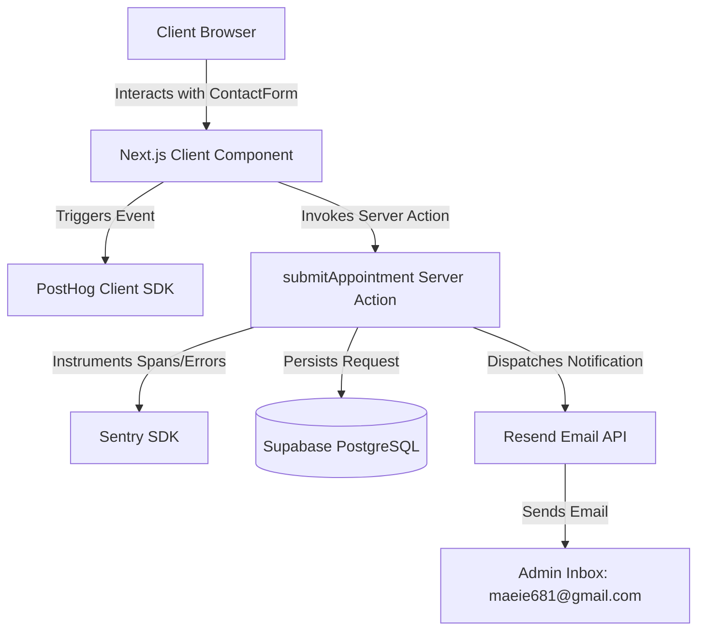

# COMPUTER SHOP & SERVICE - Presentation and Appointment Management Platform

A modern, high-performance web platform built with Next.js (App Router), Tailwind CSS, and TypeScript. It features a complete customer booking flow, fuzzy-searchable services, live Google reviews, dynamic components, and full telemetry integration (PostHog for analytics, Sentry for monitoring, Resend for email notifications, and Supabase for cloud database storage).

---

## 🏗️ Architecture

The platform follows a modern Serverless/Jamstack pattern leveraging Next.js React Server Components (RSC) for maximum performance, and Server Actions for secure backend mutations.



### Key Directories
- `src/app/` - Application routes, layouts, and Server Actions (`actions.ts`).
- `src/components/` - Highly interactive frontend UI components.
- `src/lib/` - Shared service client initializations (e.g., Supabase client).
- `src/data/` - Static/configuration files and local content data.

---

## 🛠️ Tech Stack

### Core Framework & Styling
- **Framework:** Next.js (App Router)
- **Styling:** Tailwind CSS with utility-first CSS variables
- **Language:** TypeScript (Strict Mode)
- **Animations:** Framer Motion

### Third-Party Services
- **Database:** Supabase (PostgreSQL with Row Level Security enabled)
- **Email Dispatch:** Resend SDK
- **Telemetry & Logging:** Sentry SDK (Client/Server/Edge coverage)
- **Product Analytics:** PostHog SDK

---

## 🚀 Quick Start

Follow these steps to run the application locally on your machine.

### Prerequisites
- Node.js 18.x or later installed
- npm or yarn package manager

### 1. Clone the repository
```bash
git clone https://github.com/AndreiNeptune/IT-and-Computer-Service.git
cd IT-and-Computer-Service
```

### 2. Configure Environment Variables
Copy the env template and fill in your credentials:
```bash
cp .env.example .env.local
```
Edit `.env.local` with your respective API keys:
```env
NEXT_PUBLIC_SUPABASE_URL=your_supabase_url
NEXT_PUBLIC_SUPABASE_ANON_KEY=your_supabase_anon_key
RESEND_API_KEY=your_resend_api_key
NEXT_PUBLIC_POSTHOG_KEY=your_posthog_key
NEXT_PUBLIC_POSTHOG_HOST=https://eu.i.posthog.com
NEXT_PUBLIC_SENTRY_DSN=your_sentry_dsn
```

### 3. Install Dependencies
```bash
npm install
```

### 4. Run Development Server
```bash
npm run dev
```
Open [http://localhost:3000](http://localhost:3000) to view the application in the browser.

### 5. Build for Production
To build and verify compilation and linting:
```bash
npm run build
```
